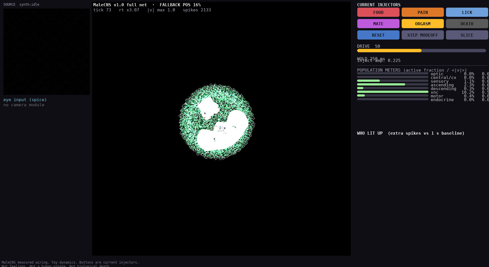
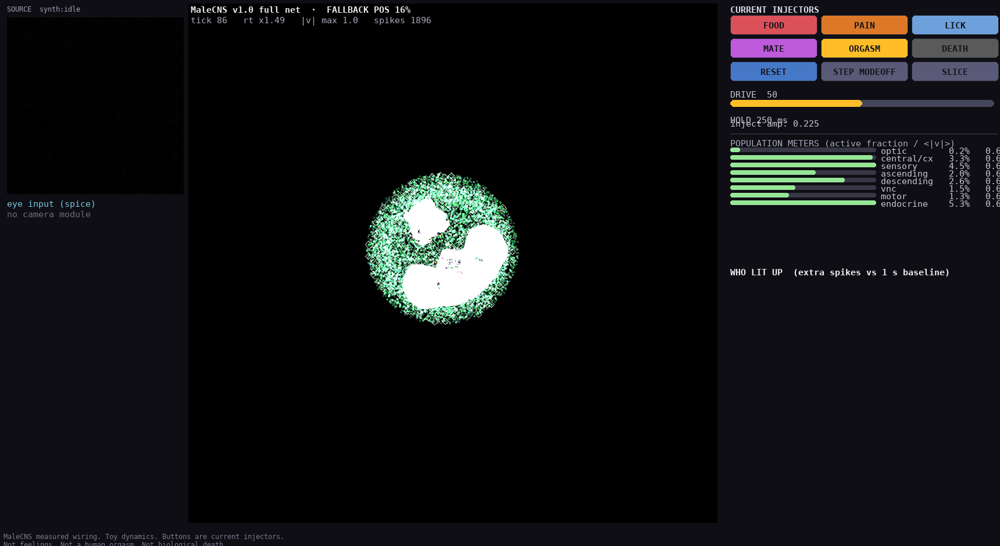
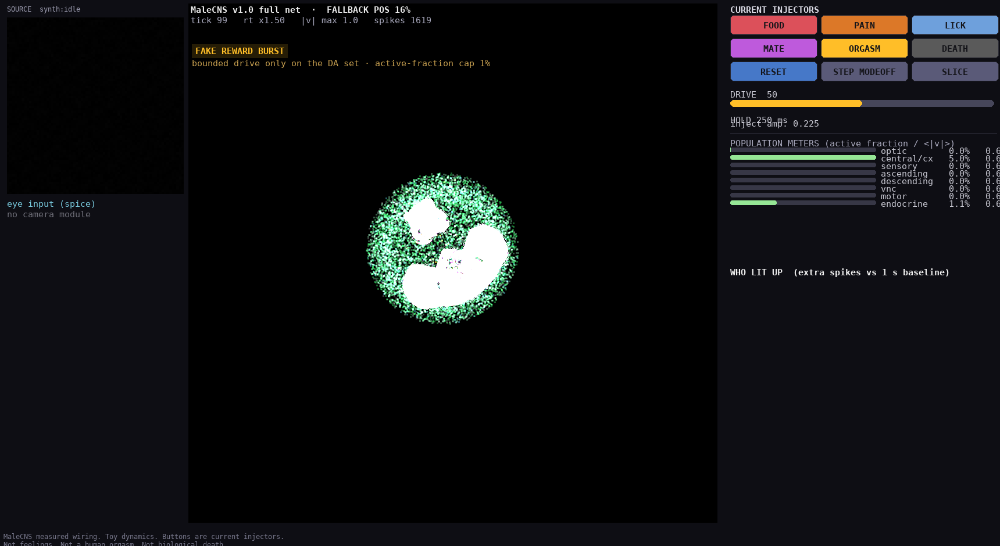
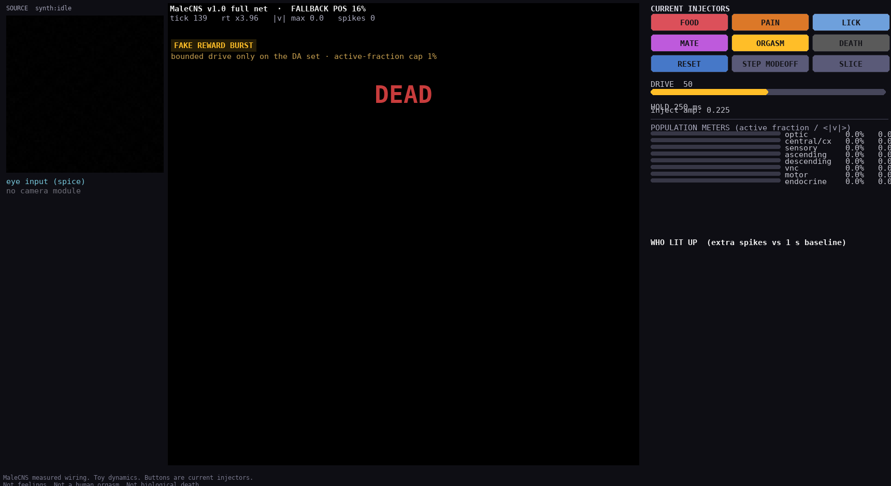
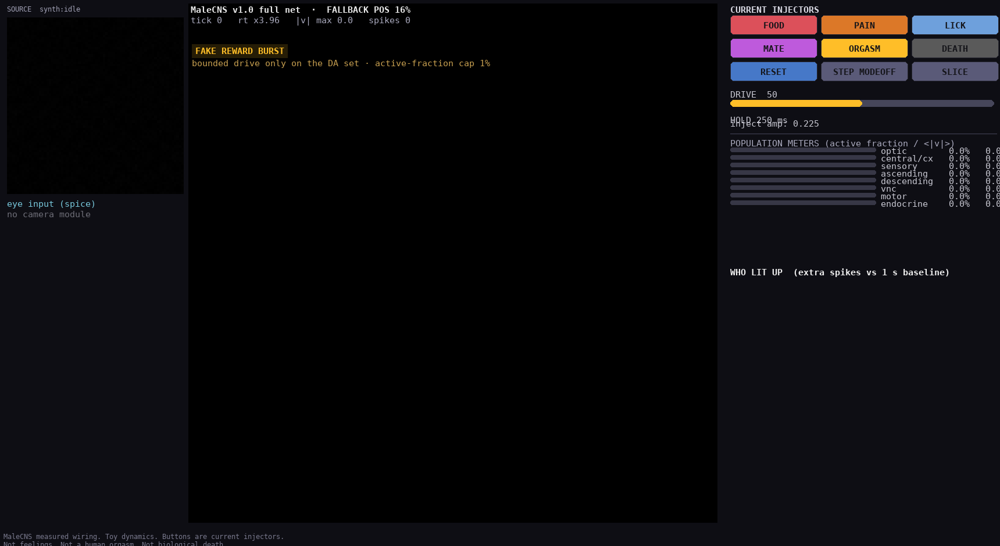

# FLYBOARD

**Real MaleCNS wiring. Toy dynamics. Buttons are current injectors.**


FLYBOARD is an arcade window into the full **166,700-neuron male fruit-fly central
nervous system** — the MaleCNS v1.0 connectome released by Janelia FlyEM. Six arcade
buttons inject simulated current directly into the *actual resolved cell populations*
of the real connectome, whose 25.58M directed synapses all run live on your GPU-free
CPU. The glow on the brain is **not an animation**: it is the voltage/spike field of a
leaky-integrator simulation crossing that real wiring.

## Quick facts

| | |
|---|---|
| neurons | **166,700** whole-CNS cells, typed and 3D-positioned |
| synapses | **25,582,938** directed synapse counts (input-normalized per postsynaptic cell) |
| data | MaleCNS v1.0 (Dorkenwald et al., *Cell* 2026) — Janelia FlyEM + collaborators |
| runtime | ~4x real-time on the full net · ~113x in `--lite` |
| stack | Python 3.12+ · pygame-ce · numpy · scipy · numba · [MIT](./LICENSE) |

## Contents

- [Screenshots](#screenshots)
- [What the buttons do](#what-the-buttons-do)
- [Physics](#physics)
- [Quick start](#quick-start)
- [Options](#options)
- [Controls](#controls)
- [Requirements](#requirements)
- [Performance](#performance)
- [Repository layout](#repository-layout)
- [Inspiration & provenance](#inspiration--provenance)
- [License](#license)

---

## Screenshots

| | |
| --- | --- |
|  |  |
| *Idle — untouched MaleCNS wiring sits dark, near-critical.* | *FOOD — taste cells (`SNta*`) are injected; the wave is real voltage propagation.* |
|  |  |
| *MATE — the courtship circuit (pIP1 et al.) lights up.* | *ORGASM — "FAKE REWARD BURST", bounded to a 1%-of-net dopamine subset.* |
|  |  |
| *DEATH — the whole brain freezes. Not biological death.* | *RESET — clears death, back to near-critical idle.* |

> MaleCNS measured wiring. Toy dynamics. Buttons are current injectors.
> Not feelings. Not a human orgasm. Not biological death.

The footer of every frame says exactly that. The **connectome is real**; the
**dynamics are a toy** — a leaky integrator tuned to sit **near-critical** (dark at
rest, localized measured waves on demand) because the same real matrix is globally
bistable at canonical settings (see [Physics](#physics)). There is **no camera module**
anywhere in the codebase.

---

## What the buttons do

Buttons inject a constant `I_button` into the resolved MaleCNS cell IDs for a
`HOLD` window (default 250 ms). The glowing cloud **is** the voltage field.

| Button | Key | Drives these real MaleCNS cells | Effect |
|---|---|---|---|
| **FOOD** | `1` | taste cells, `SNta*` family prime (2799 cells, 57 types) | sweet/gustatory burst |
| **PAIN** | `2` | nociceptor class, includes ppk receptor cells (257 cells) | aversive localized wave |
| **LICK** | `3` | proboscis extension motor neurons (68 cells) | reflexive feeding motor burst |
| **MATE** | `4` | courtship circuitry incl. **pIP1** (3165 cells) | courtship ensemble lights |
| **ORGASM** | `5` | the real **dopaminergic** population (4443 cells) | **FAKE REWARD BURST** — capped, see below |
| **DEATH** | `d` | — | freezes every voltage to 0; the whole brain goes dark |
| **RESET** | `r` | — | clears death, restores near-critical idle |

Cell counts come from `data/out/hits.json`, written after every cache load, with
`requested_types` / `found_count` / `missing_types` / `proxy_used` per button. If a
button resolves to zero exact cells (e.g. on the LITE subsample) it still fires as an
orange **PROXY**, driving a superclass subset instead.

### FAKE REWARD BURST — the ORGASM cap

MaleCNS idle sits `SIM_BG` below threshold, and a large drive can ignite the entire
CNS. The reward burst is therefore **bounded by construction**: ORGASM drives at most
`cap × n` reward cells (cap = **0.01**, i.e. ~1,667 of the DA population), enforced in
`Sim.inject(..., bounded_extra=True)` and reported live as `reward_driven_fraction`.

### Leaderboard — "WHO LIT UP"

Light-up score = *(spikes during hold + 300 ms)* − *(rolling 1 s baseline)*, counting
only cells that beat their baseline by **≥ 1 spike**. Rendered per type and per
superclass, so a burst's identity is legible as real fly types (`LC10a`, `ORN_DA1`,
`TmY21`, …) rather than "something lit up".

---

## Physics

Per 20 ms tick:

```
v  <-  exp(-dt/0.1) · v  +  SIM_W_GAIN · W·spikes  +  SIM_BG  +  noise  +  retina  +  I_button
spike if v >= 1:  v = 0
```

`W` is the untouched MaleCNS weight table (synapse counts, column-normalized per
postsynaptic cell). Shipped constants: **`SIM_W_GAIN = 1.0`**, **`SIM_BG = 0.110`**,
noise `0.06`.

**Why not the "obvious" stronger drive?** At the canonical `1.5 / 0.180`, the real
25.58M-edge matrix is *globally bistable*: rest sits at `v_ss = 0.18/(1 − e^(−0.2)) ≈ 0.993`,
just 0.007 V under threshold — any single spike (even a noise blip) snowballs into a
permanent whole-CNS strobe of ~166k cells/tick. The shipped constants run the **same
untouched wiring** in the near-critical regime: dark idle, button bursts are measured,
localized waves, and the leaderboard means something.

---

## Quick start

`./run-flyboard` bootstraps a Python venv (`.venv/`) and installs requirements on
first use, so a fresh machine needs only Python 3.12+ and ~2.5 GB of disk.

```bash
git clone git@github.com:NullLabTests/flybrain.git
cd flybrain

./run-flyboard fetch          # download ~1.3 GB of Janelia MaleCNS v1.0 tables + soma shards
./run-flyboard build          # build data/out/flyboard_graph.npz (166,700 cells) + manifest
./run-flyboard                # full 166k net, arcade UI
```

Already have the cache? `fetch` and `build` skip work that is done and report it.
No MaleCNS cache at all? `./run-flyboard --lite` falls back to a synthetic fixture so
the UI always opens.

## Options

```
./run-flyboard [--lite] [--source SEL] [--step] [--noise F] [--hold-ms MS]
               [--drive F] [--seed N] [--cite] [--build-only] [--headless]
```

| Option | Meaning |
|---|---|
| `--lite` | 4096-cell **LITE BRAIN** subsample spanning all superclasses (~113x real-time) |
| `--source SEL` | eye-input pane: `synth:idle` (**default**) · `synth:pattern` · `image:PATH` · `video:PATH` |
| `--step` | force STEP mode — burst on button, then frozen lit cloud |
| `--noise F` | per-tick noise sigma (default `0.06`; raise for a twitchier net) |
| `--hold-ms MS` | button injection hold window in ms (default `250`) |
| `--drive F` | DRIVE fraction 0..1 (default `0.5`); also the `+`/`−` keys and panel slider |
| `--seed N` | RNG seed (defaults to a fixed seed per process) |
| `--cite` | print paper + data citations and exit |
| `--build-only` | build the graph cache and exit (no UI) |
| `--headless` | run the UI on a dummy video driver (used by tests / screenshot tooling) |

## Controls

| Input | Action |
|---|---|
| **1–5** / **d** / **r** | FOOD / PAIN / LICK / MATE / ORGASM / DEATH / RESET |
| **mouse click on panel button** | same as the key |
| **`+` / `−`** or the DRIVE slider | injection strength ±10% |
| **p** / **STEP** | STEP mode toggle |
| **s** / **SLICE** | hide the optic lobes |
| **drag** | rotate the 3D soma cloud |
| **mouse wheel** | zoom |
| **click a glowing cell** | pin it: type · superclass · side (last few shown) |
| **Esc / q** | quit |

## Requirements

Python **3.12+**. Core: `numpy`, `scipy`, `pygame-ce`, `numba`, `PyYAML`, `pyarrow`,
`pandas`. Data tooling: `neuroglancer` + `tensorstore` (soma reading), `imageio`
(optional, only for `--source video:`). Everything installs automatically into
`.venv/` on first `run-flyboard` invocation; a system Python with scientific wheels
(apt/system-site-packages) keeps the first build fast.

## Performance

- **Full net (166,700 cells)**: ~4x real-time on a mid-range laptop; the whole UI
  (render, meters, leaderboard) draws from pure numpy + numba — no GPU needed.
- **LITE (4,096 cells)**: ~113x real-time — bursts resolve in well under a second.
- If real-time ever drops below 0.25x, the UI **auto-engages STEP mode** (burst on
  button, then frozen lit cloud) so the arcade never lags out.

## Repository layout

```
flyboard/         python package
  __init__.py     shipped constants, footer disclaimer, ORGASM cap
  build.py        Janelia feather tables -> CSR graph (real, safe numbers)
  soma.py         neuroglancer AnnotationReader -> measured soma positions
  data.py         fetch / status of the remote Janelia cache
  graph.py        graph loading, LITE subsample, region codes, colors
  resolve.py      button -> MaleCNS type -> cell IDs (+ hits.json, proxies)
  sim.py          leaky-integrator physics, hold + measure windows
  source.py       eye-input pane (synth / image / video)          [no camera]
  render.py       software 3D point-cloud renderer (pure numpy)
  stats.py        "who lit up" leaderboard
  ui.py           3-pane pygame UI
  cite.py         paper + data citations
tests/            headless spec tests, including scripted mouse clicks
scripts/          headless screenshot gallery generator
presets.yaml      button -> type/selector definitions
docs/screens/     README screenshots (generated, not hand-drawn)
```

---

## Inspiration & provenance

FLYBOARD is a small love letter to the 2026 MaleCNS v1.0 release:

> Dorkenwald, S., et al. (2026). *Sexual dimorphism in the complete Drosophila male
> central nervous system connectome.* Cell, 30(11), 3090–3090.
> Data: Janelia Research Campus / Google Research FlyEM, Cambridge, and collaborators.

- **The anatomy is real.** Every resolved button population is a typed MaleCNS cell
  group: taste `SNta*` cells, ppk nociceptors, proboscis motor neurons, pIP1 courtship
  neurons, the dopamine projection set.
- **Soma positions are measured.** The MaleCNS soma-points shards are read through the
  neuroglancer annotation reader — no hand-rolled binary parsing.
- **The arcade idea is borrowed with love.** Reward buttons that light a *brain* nod to
  the classic "pleasure button" thought experiment (Olds & Milner, 1954) — and to every
  demo where the glow is honestly computed rather than faked.

The fly deserves better than a strobe. FLYBOARD keeps the real wiring at its own
critical edge so a press shows you *which corner of the MaleCNS actually reacts*.

## License

[MIT](./LICENSE). The FLYBOARD code is MIT-licensed; the MaleCNS v1.0 data remains
copyright its respective owners (Janelia FlyEM et al.), whose terms apply to the data
itself.